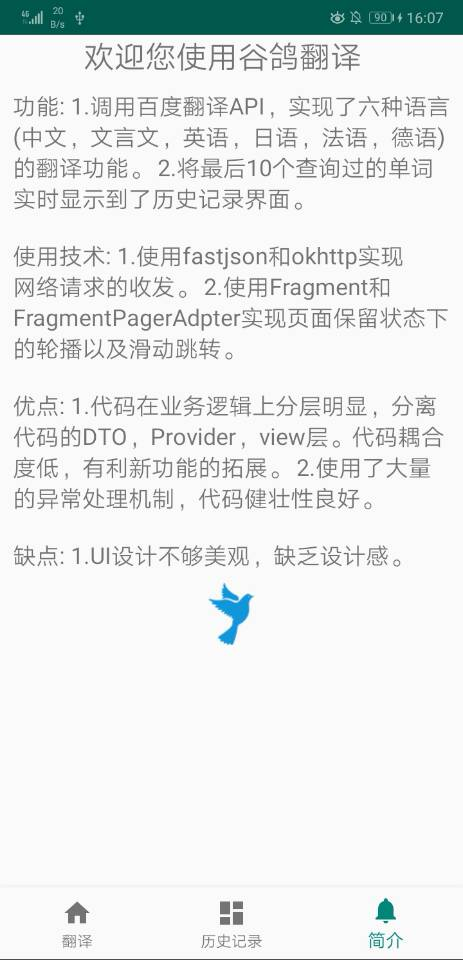

# 安卓期末大作业之谷鸽翻译
(觉得有用的小伙伴点个Star呀)

## 功能
- 调用百度翻译API，实现了六种语言(中文，文言文，英语，日语，法语，德语)的翻译功能。
- 将最后10个查询过的单词实时显示到了历史记录界面。

## 使用技术
- 使用fastjson和okhttp实现网络请求的收发。
- 使用Fragment和FragmentPagerAdpter实现页面保留状态下的轮播以及滑动跳转。

## 优点
- 代码在业务逻辑上分层明显，分离代码的DTO，Provider，view层。代码耦合度低，有利新功能的拓展。
- 使用了大量的异常处理机制，代码健壮性良好。

## 缺点
- UI设计不够美观，缺乏设计感。

## 截图展示

## LICENSE
MIT License